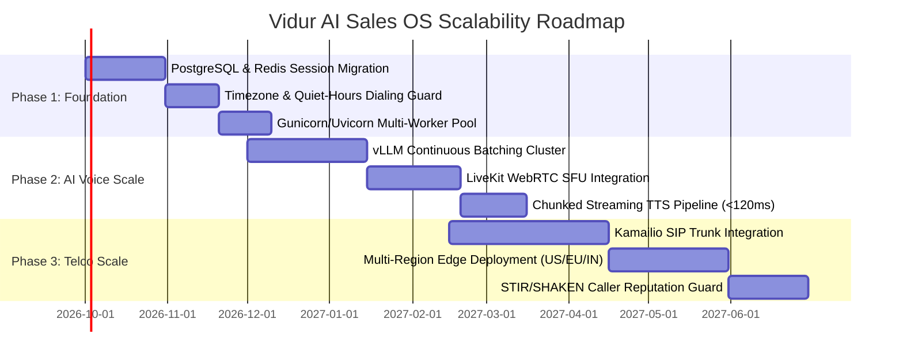

# Vidur AI Sales OS — Scalability, Concurrency & High-Throughput Deployment Architecture

This document provides a technical blueprint and concurrency analysis for scaling the Vidur AI Sales Operating System from local single-workstation development to an enterprise platform capable of supporting **1,000 to 10,000+ concurrent live voice calls**.

---

## 1. Executive Summary: The Voice AI Concurrency Challenge

Unlike traditional web applications where a single web server can easily handle thousands of HTTP requests per second, **conversational voice AI is latency-bound and compute-heavy**. 

Every live call involves a real-time full-duplex conversational pipeline operating across three tightly coupled stages:

$$\text{Voice Pipeline Roundtrip} = T_{\text{VAD}} + T_{\text{STT}} + T_{\text{LLM TTFT}} + T_{\text{TTS TTFB}} + T_{\text{Network}}$$

Where:
- $T_{\text{VAD}}$: Voice Activity Detection & turn-taking silence detection (~200ms–350ms)
- $T_{\text{STT}}$: Audio chunk transcription (~150ms–300ms)
- $T_{\text{LLM TTFT}}$: Large Language Model Time-to-First-Token (~250ms–500ms)
- $T_{\text{TTS TTFB}}$: Text-to-Speech Time-to-First-Audio-Byte (~100ms–200ms)
- $T_{\text{Network}}$: WebSocket/WebRTC packet roundtrip (~50ms–100ms)

> [!IMPORTANT]
> **The 1.2-Second Latency Ceiling**: In human telephone conversation, silence longer than **1.2 to 1.5 seconds** is perceived as an awkward pause, hesitation, or dropped call. Therefore, scaling voice AI is not merely about handling connections—it is about **guaranteeing sub-second generation latency under peak concurrent loads**.

---

## 2. Current Concurrency Capacity: How Many Calls Can Be Deployed at Once?

| Deployment Profile | Compute Infrastructure | Max Concurrent Active Calls | Latency / Call | Key Limiting Bottleneck |
| :--- | :--- | :--- | :--- | :--- |
| **100% Local Inference** *(Current Dev)* | 1x Workstation GPU (RTX 4090 / RTX 3060 / A10G) + 8-core CPU | **3 – 5 calls** | 800ms – 1.4s | **GPU VRAM & Sequential LLM/STT queuing**: Ollama (`gemma3:4b`) and Faster-Whisper serialize prompt processing on a single GPU. |
| **Hybrid Cloud (API offload)** | 1x Standard Cloud VM (8 vCPU, 16GB RAM) + Cloud APIs (Sarvam/Deepgram STT + Groq/Claude 3.5 + Cartesia TTS) | **30 – 50 calls** | 500ms – 900ms | **FastAPI Async I/O & Network Sockets**: Bounded by Python asyncio event loop and WebSocket memory buffering. |
| **Dedicated GPU Inference Cluster** | 4x NVIDIA A10G / 2x H100 with vLLM + Triton Whisper | **150 – 300 calls** | 400ms – 750ms | **Continuous Batching limits** and audio transcoding bitrate. |
| **Distributed Enterprise Platform** | Kubernetes Autoscaling + LiveKit WebRTC SFU + vLLM cluster + SIP Trunking | **1,000 – 10,000+ calls** | 350ms – 600ms | **Carrier SIP trunk concurrency limits** & cloud quota. |

---

## 3. Deep Dive: Key Architectural Bottlenecks

### Bottleneck 1: LLM Sequential Prompt Queuing
- **Current Architecture**: Standard local Ollama (`gemma3:4b`) processes inferences sequentially or with limited batching (`OLLAMA_NUM_PARALLEL=1` by default).
- **Failure Mode**: When 5 calls speak at the exact same sub-second window, calls 4 and 5 must wait in the CUDA compute queue. Inference latency spikes from 350ms to **3,000ms+**, completely breaking the conversational illusion.
- **Solution**: Multi-GPU deployment running **vLLM** or **TensorRT-LLM** with **PagedAttention** and **Continuous Batching**.

### Bottleneck 2: Audio Streaming & Transcoding Contention
- **Current Architecture**: Direct WebSockets connected into a single FastAPI Python process.
- **Failure Mode**: Python's Global Interpreter Lock (GIL) and asyncio event-loop saturation cause micro-stutters during heavy audio resampling (e.g. converting 48kHz browser audio to 16kHz PCM mono for Whisper).
- **Solution**: Offload audio ingestion to a dedicated WebRTC Selective Forwarding Unit (SFU) written in Go or C++ (e.g. **LiveKit**).

### Bottleneck 3: Database Write Contention
- **Current Architecture**: SQLite local file storage (`backend/sales_platform.db`).
- **Failure Mode**: SQLite relies on database-level file locks. When >10 calls attempt to flush transcript tokens, sentiment scores, and qualification states concurrently, SQLite throws `sqlite3.OperationalError: database is locked`.
- **Solution**: Migrate to **PostgreSQL** with **PgBouncer** connection pooling and **Redis** for in-memory session state.

### Bottleneck 4: Telephony & Signaling Limitations
- **Current Architecture**: Single-host WebSockets without PSTN carrier connections.
- **Failure Mode**: Cannot scale to real telephone network numbers without an elastic carrier Session Border Controller (SBC).
- **Solution**: Integrate **Kamailio SIP Proxies** and **FreeSWITCH Media Gateways** connected to Tier-1 SIP trunks.

---

## 4. Target Scale Architecture: Blueprint for 1,000+ Concurrent Calls

The diagram below illustrates the decoupled, enterprise-grade architecture required to sustain 1,000+ simultaneous voice calls:

```
                                  [ Public PSTN / WebRTC Clients ]
                                                │
                                    ┌───────────┴───────────┐
                                    ▼                       ▼
                         [ Kamailio SIP Proxy ]   [ LiveKit WebRTC SFU ]
                         (Elastic Carrier Trunks) (Browser & WebRTC Audio)
                                    │                       │
                     ═══════════════╪═══════════════════════╪═══════════════
                               Distributed Redis Audio Streams / gRPC
                     ═══════════════╪═══════════════════════╪═══════════════
                                    ▼                       ▼
                     ┌─────────────────────────────┬─────────────────────────────┐
                     │     STT Worker Pool         │       TTS Worker Pool       │
                     │  (Deepgram Nova-2 / Whisper │   (Cartesia Sonic / Piper   │
                     │   Triton Inference Cluster) │    ONNX Streaming Workers)  │
                     └──────────────┬──────────────┴──────────────▲──────────────┘
                                    │                             │
                                    ▼                             │
                     ┌────────────────────────────────────────────┴──────────────┐
                     │                   Voice Agent Orchestrator                │
                     │            (Temporal.io / Celery State Machine)           │
                     └──────────────────────────────┬────────────────────────────┘
                                                    │
                                    ┌───────────────┴───────────────┐
                                    ▼                               ▼
                      [ High-Throughput LLM Cluster ]     [ Enterprise Data Tier ]
                      - vLLM with PagedAttention          - PostgreSQL Cluster
                      - Continuous Batching (A10G/H100)   - Redis In-Memory Cache
                      - Groq / Anthropic Cloud Fallback   - AWS S3 / Cloudflare R2
```

---

## 5. Component Breakdown & Scaling Strategy

### 5.1. Telephony & Media Signaling Layer
- **LiveKit SFU (WebRTC)**:
  - Deployed on Kubernetes nodes running the LiveKit media server.
  - Handles up to 20,000 simultaneous audio channels with built-in jitter buffering, packet loss concealment (PLC), and DTX (Discontinuous Transmission).
- **Kamailio SIP Proxy + FreeSWITCH**:
  - Acts as a Session Border Controller (SBC) connecting to Tier-1 carrier trunks (Twilio Elastic SIP, Telnyx, Tata Communications, Bandwidth).
  - Handles SIP INVITE, BYE, and RTP audio relay with automatic carrier failover.

### 5.2. Distributed Real-Time AI Pipeline
- **Speech-to-Text (STT) Pool**:
  - Inbound audio streams are chunked via client-side Silero VAD (Voice Activity Detection).
  - Transcribed via dedicated NVIDIA Triton Inference Server running Faster-Whisper / TensorRT-LLM, or streamed over bidirectional gRPC to Deepgram Nova-2 (<150ms latency).
- **High-Throughput LLM Serving via vLLM**:
  - Replace local Ollama with **vLLM** running across an autoscaling multi-GPU cluster.
  - Employs **PagedAttention** and **Continuous Batching** to compute tokens across hundreds of active streams without serialization delay.
  - A single cluster of 4x NVIDIA A10G (96GB total VRAM) comfortably sustains **100+ concurrent active conversational streams** at <350ms TTFT.
  - Hybrid failover to ultra-fast inference APIs (Groq Llama-3-70B @ 300 tokens/sec, Claude 3.5 Haiku) during traffic spikes.
- **Streaming Low-Latency TTS Pool**:
  - Implements **Sentence-Chunk Streaming**: Rather than waiting for the entire LLM response, the agent streams text to TTS as soon as the first 4–6 tokens (a grammatical clause) are generated.
  - Powered by Cartesia Sonic, ElevenLabs Flash, or local Piper ONNX streaming workers.
  - **Time-to-First-Audio-Byte (TTFB)** is reduced to **<120ms**.

### 5.3. Campaign Orchestration & Predictive Dialing
- **Pacing Engine (Temporal.io / Kafka / Celery)**:
  - Manages dial queues across tens of thousands of leads.
  - **Predictive Dialing Pacing Algorithm**: Dynamically calculates the optimal dialing multiplier ($N$ dials per available AI agent channel) based on live answer rates, voicemail drop rates (Answering Machine Detection / AMD), and agent capacity:
    $$N_{\text{dials}} = \frac{C_{\text{idle agents}}}{\text{Estimated Answer Rate}} \times (1 - \text{Target Abandonment Rate})$$
- **Timezone & Quiet-Hours Compliance Engine**:
  - Automatically queries the prospect's local timezone (e.g. US Pacific, Eastern, India IST, UK GMT).
  - Enforces TCPA & TRAI compliance rules: blocks calls between 8:00 PM and 8:00 AM local time and scrubs against National Do-Not-Call (DNC) registries before dispatch.

### 5.4. Enterprise Persistence & State Layer
- **PostgreSQL Cluster (Primary + Read Replicas)**: Stores lead data, CRM records, campaign configs, and call audit logs. Uses **PgBouncer** connection pooling to support 10,000+ client connections.
- **Redis Cluster**: Stores active in-call sessions, ephemeral conversational memory, live transcript buffers, and real-time BANT qualification scores.
- **Cloudflare R2 / AWS S3**: Stores dual-channel call audio recordings (WAV/MP3), signed download URLs, and compliance transcripts.

---

## 6. Infrastructure Sizing & Cost Estimation Matrix

| Target Scale | Recommended Infrastructure | Estimated Monthly Cloud Cost | Primary Use Case |
| :--- | :--- | :--- | :--- |
| **1 – 10 Calls** | 1x Dedicated Workstation (RTX 4090, 64GB RAM) or 1x AWS `g5.2xlarge` | ~$200 – $400 / mo | Developer testing, internal demos, initial pilot |
| **50 – 100 Calls** | 2x AWS `g5.12xlarge` (4x A10G) + 1x `c6i.2xlarge` (FastAPI + Redis) + Managed Postgres | ~$2,500 – $3,500 / mo | Growth-stage outbound sales team (10,000 calls/day) |
| **500 Calls** | 4x AWS `g5.12xlarge` + LiveKit SFU Cluster + Redis Cluster + RDS Postgres Multi-AZ | ~$8,000 – $12,000 / mo | Mid-market enterprise call center |
| **1,000+ Calls** | Kubernetes Cluster on EKS (GPU Node Pools + LiveKit SFU + Kamailio SIP Gateways + Deepgram gRPC) | ~$18,000 – $25,000 / mo | Large-scale telecom dialer (100,000+ calls/day) |

---

## 7. Phased Scalability Roadmap



### Phase 1: Foundation (0 – 3 Months)
- Migrate from SQLite to **PostgreSQL + Redis**.
- Enforce automated **Timezone & Quiet-Hours dialing guardrails** (9:00 AM – 6:00 PM local prospect window).
- Deploy **Gunicorn/Uvicorn multi-worker** process distribution behind Nginx.
- Introduce **Email-based pitch outreach** to complement voice dial attempts when prospects are outside calling hours.

### Phase 2: Voice Throughput (3 – 6 Months)
- Deploy **vLLM multi-GPU inference cluster** with continuous batching and PagedAttention.
- Transition from local PyAudio to **LiveKit WebRTC SFU** for browser calling.
- Implement sentence-chunked streaming TTS (<120ms TTFB).
- Implement predictive dialer engine with Answering Machine Detection (AMD).

### Phase 3: Telco Scale (6 – 12 Months)
- Connect **Kamailio SIP proxies** with elastic PSTN carrier trunks.
- Multi-region Kubernetes deployment (US East, US West, Europe, India) for sub-50ms network edge latency.
- STIR/SHAKEN A-level attestation & spam reputation monitoring.
- Automated post-call CRM sync (Salesforce, HubSpot, Zoho) via Kafka event stream.
